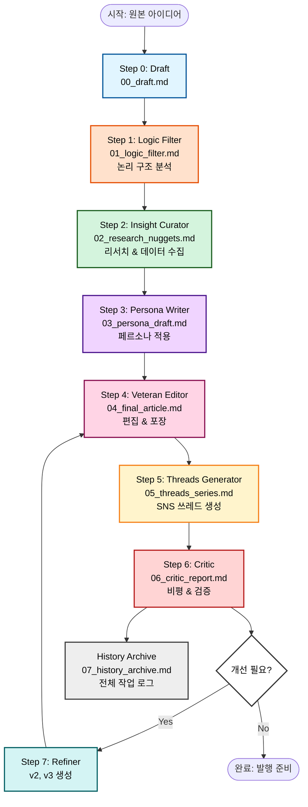
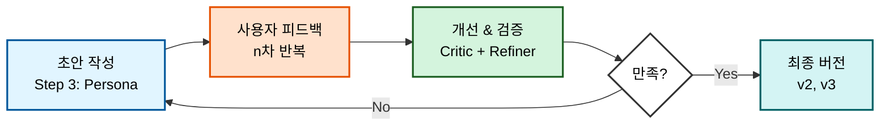
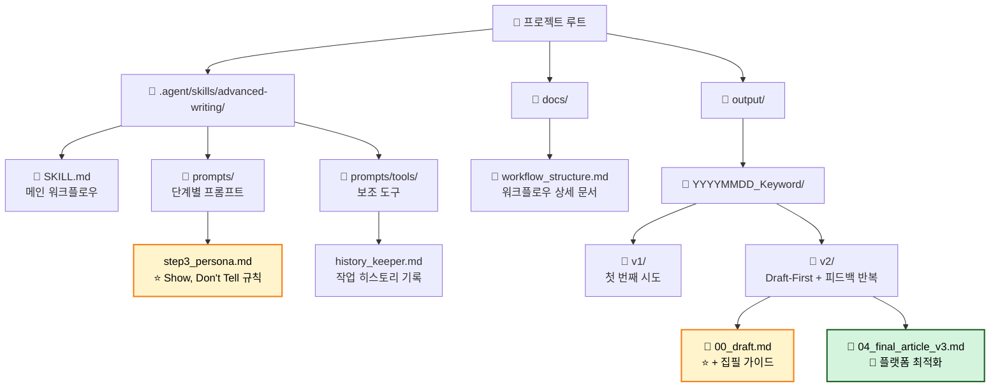

# Advanced Writing Flow (SNS 글쓰기 에이전트)

## 📌 프로젝트 소개

이 프로젝트는 단순한 글쓰기 보조 도구를 넘어, 프로페셔널한 수준의 콘텐츠를 제작하기 위한 에이전트 기반의 7단계 고급 집필 워크플로우입니다.
아이디어 구상부터 심층 리서치, 집필, 비평, 그리고 최종 편집에 이르기까지, 인간 작가와 에이전트가 협업하여 최상의 결과물을 만들어내는 시스템입니다.

특히 **Perplexity MCP**를 활용한 심층 리서치와 **사용자 피드백 반복 개선**을 통해 데이터에 기반한 탄탄한 글쓰기를 지원합니다.

## ✨ 7단계 핵심 워크플로우 (Core Workflow)



### 각 단계 설명

1. **Step 0. 초안 기록 (Original Draft)**
    - 사용자의 아이디어와 메모를 보존
    - v2부터: **집필 방향성 가이드** 포함 (타깃 독자, 리서치 규칙, 페르소나 원칙)

2. **Step 1. 논리 필터 (The Logic Filter)**
    - 불필요한 '호들갑' 제거
    - 단단한 논리적 뼈대 구축

3. **Step 2. 리서치 큐레이션 (The Insight Curator)**
    - Perplexity AI를 통한 최신 트렌드 발굴
    - 'Golden Nuggets(결정적 통찰)' 선별

4. **Step 3. 페르소나 집필 (The Persona Writer)**
    - 타깃 독자를 고려한 톤앤매너 적용
    - **Show, Don't Tell** 원칙 적용 (간접 표현)

5. **Step 4. 베테랑 편집 (The Veteran Editor)**
    - 모바일 최적화 가독성 편집
    - Hook 제목 설계

6. **Step 5. 쓰레드 생성 (The Threads Generator)**
    - SNS 환경에 맞춘 바이럴 쓰레드 변환
    - 플랫폼별 최적화

7. **Step 6. 냉철한 비평 (The Critic)**
    - 제3자 시각에서 원고 분석
    - 약점 지적 및 개선안 제시

8. **Step 7. 최종 개선 (The Refiner)**
    - Critic 피드백 반영
    - v2, v3 등 개선 버전 생성
    - **History Archive** 자동 생성

## 🔄 사용자 피드백 반복 프로세스



## 📂 프로젝트 구조



### 디렉토리 상세

```
root/
├── .agent/
│   └── skills/
│       └── advanced-writing/
│           ├── SKILL.md                    # 워크플로우 정의
│           ├── prompts/
│           │   ├── step0_draft.md
│           │   ├── step1_logic_filter.md
│           │   ├── step2_research.md
│           │   ├── step3_persona.md        # ⭐ Show, Don't Tell 규칙
│           │   ├── step4_editor.md
│           │   ├── step5_threads.md
│           │   ├── step6_critic.md
│           │   └── step7_refiner.md
│           └── prompts/tools/
│               └── history_keeper.md
├── docs/
│   └── workflow_structure.md              # 워크플로우 상세 문서
├── output/
│   └── {YYYYMMDD}_{Keyword}/
│       ├── v1/                            # 첫 시도
│       │   └── 00~07_*.md
│       └── v2/                            # 개선 버전
│           ├── 00_draft.md                # + 집필 가이드
│           ├── 01~07_*.md
│           ├── 04_final_article_v2.md
│           └── 04_final_article_v3.md     # 플랫폼 최적화
└── README.md
```

## 🎯 핵심 원칙

### 워크플로우 설계 원칙

1. **단계별 분리**: 각 단계는 독립적인 파일로 저장
2. **반복 가능**: Critic → Refiner → Editor 피드백 루프
3. **기록 보존**: History Archive로 전체 진화 과정 추적
4. **버전 관리**: v1, v2, v3로 점진적 개선

### 파일 명명 규칙

- `00_draft.md`: 원본 (+ 집필 가이드)
- `01~07_*.md`: 단계별 산출물
- `*_v2.md`, `*_v3.md`: 개선 버전
- `07_history_archive.md`: 전체 로그

### 폴더 분리 기준

- `v1/`: 첫 번째 접근 방식 (실험)
- `v2/`: 개선된 접근 방식 (사용자 피드백 반영)
- 각 폴더는 독립적인 완전한 워크플로우 포함

## 🚀 시작하기

1. **초안 입력**: 에이전트에게 쓰고 싶은 주제나 대략적인 초안을 입력하세요.
2. **집필 가이드 작성**: 타깃 독자, 리서치 규칙, 페르소나 원칙을 `00_draft.md`에 명시
3. **단계별 진행**: 에이전트가 안내하는 단계에 따라 진행하며, 필요시 피드백 제공
4. **반복 개선**: Critic 리포트를 확인하고 Refiner로 v2, v3 생성
5. **결과 확인**: `output` 폴더에 모든 결과물이 자동 저장

## ⚠️ 필수 요구 사항

- **Perplexity MCP**: 실시간 정보 검색 및 리서치 지원
- **Sequential Thinking MCP**: 복잡한 논리 분석 지원

## 📖 상세 문서

워크플로우 구조와 다이어그램에 대한 자세한 내용은 [`docs/workflow_structure.md`](docs/workflow_structure.md)를 참고하세요.
