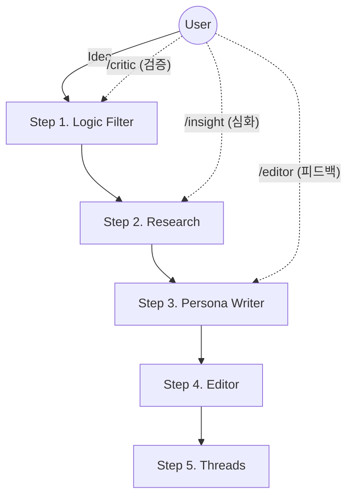

# 🛠️ On-Demand Tools 활용 시나리오 (ASCII Visualizer)

사용자가 제안된 3가지 명령어(`/critic`, `/insight`, `/editor`)를 실제 작업 흐름에서 어떻게 활용할 수 있는지 보여주는 시각화 문서입니다.

---

## 🏗️ 1. 전체 워크플로우 맵 (The Big Picture)

기존의 `Advanced Writing Flow`는 선형적이지만, On-Demand Tools는 **수직적/반복적**으로 개입합니다.



---

## 📜 2. 상세 시나리오 (ASCII)

### 🛑 Scene 1: 헛발질 방지 (`/critic`)

**상황:** 막연한 아이디어만 있고 논리가 빈약할 때, 글을 쓰기 전 '팩폭'부터 맞고 시작합니다.

```text
[User]
"요즘 MZ세대는 끈기가 없다는 주제로 글 써볼까?" (Idea)
     |
     v
[ /critic 실행 ]
     | ⚡ "잠깐, 멈추세요." (Red Flag)
     |
     +--> [Critic's Report]
     |    1. 편협한 일반화: '끈기 부족'이 아니라 '참을 가치가 없는 것' 아닐까요?
     |    2. 꼰대 리스크: 이대로 쓰면 도파민 중독론과 다를 바 없습니다.
     |    3. 대안 제시: "MZ가 퇴사하는 건 끈기 문제가 아니라 '손절 지능'이 높아서다"로 비틀어보세요.
     |
     v
[User]
"오, '손절 지능' 괜찮네. 이걸로 Step 1 시작하자." (Refined Idea)
```

### 💡 Scene 2: 밋밋한 글 심폐소생 (`/insight`)

**상황:** 리서치(Step 2)까지 했는데, 뻔한 정보만 있고 '임팩트'가 부족할 때 글의 각도를 틉니다.

```text
[Step 2 Result]
"재택근무 생산성 통계: 60%가 만족..." (Boring Data)
     |
     v
[ /insight 실행 ]
     | ✨ "통념을 뒤집어봅시다." (Angle Shift)
     |
     +--> [Insight's View]
     |    - 통념: 재택근무는 '복지'다.
     |    - 이면: 재택근무는 기업이 사무실 임대료를 직원에게 전가하는 '비용 절감' 전략이다.
     |    - 질문: "당신의 월급에 '집세'가 포함되어 있습니까?"
     |
     v
[Step 3 Writing]
"재택근무는 복지가 아니라 착취다"라는 도발적 프레임으로 집필 시작.
```

### 🧐 Scene 3: 글쓰기 PT 받기 (`/editor`)

**상황:** 초고(Step 3)는 나왔는데, 뭔가 아쉬워서 바로 발행하기 찝찝할 때 '코칭'을 받습니다.

```text
[Step 3 Draft]
"그래서 우리는 변화해야 한다... (주절주절)" (Weak Ending)
     |
     v
[ /editor 실행 ]
     | 📝 "편집장의 붉은 펜입니다." (Coaching)
     |
     +--> [Editor's Feedback]
     |    - 평가: B+ (논리는 좋으나 결말이 힘 빠짐)
     |    - 지적: "변화해야 한다"는 말은 아무 감흥이 없습니다. 독자가 당장 할 수 있는 행동을 제안하세요.
     |    - 예시: "내일부터 모니터 포스트잇을 떼십시오"처럼 구체적으로.
     |
     v
[User]
"수정해서 Step 4로 넘기자." (Polished Draft)
```

---

### ✨ 요약

| 명령어       | 역할                | 비유       | 사용 타이밍                         |
| :----------- | :------------------ | :--------- | :---------------------------------- |
| **/critic**  | **Stop & Think**    | 🚦 신호등  | 시작 전, 방향이 불안할 때           |
| **/insight** | **Turn Inside Out** | 💎 렌즈    | 소재가 뻔하고 지루할 때             |
| **/editor**  | **Fix & Grow**      | 🏋️ PT 코치 | 초고 완성 후, 퀄리티 높이고 싶을 때 |
