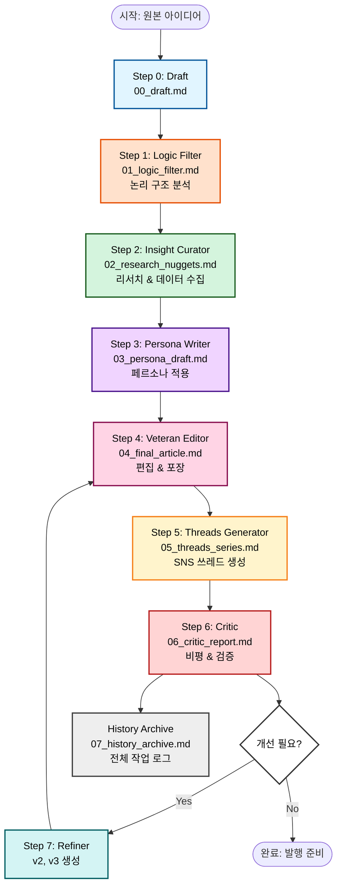
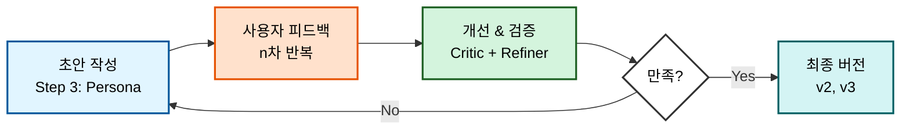
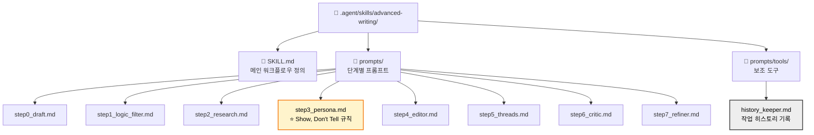

# SNS 글쓰기 워크플로우 구조

## 1. Advanced Writing Flow 프로세스

## 2. 폴더 구조

```mermaid
graph TD
    Root[📁 output/] --> Project[📁 20260126_AI_Agent_Organization/]
    
    Project --> V1[📁 v1/<br/>첫 번째 시도]
    Project --> V2[📁 v2/<br/>Draft-First + 피드백 반복]
    
    V1 --> V1_00[📄 00_draft.md]
    V1 --> V1_01[📄 01_logic_filter.md]
    V1 --> V1_02[📄 02_research_nuggets.md]
    V1 --> V1_03[📄 03_persona_draft.md]
    V1 --> V1_04[📄 04_final_article.md]
    V1 --> V1_04v2[📄 04_final_article_v2.md]
    V1 --> V1_05[📄 05_threads_series.md]
    V1 --> V1_05v2[📄 05_threads_series_v2.md]
    V1 --> V1_06[📄 06_critic_report.md]
    V1 --> V1_07[📄 07_history_archive.md]
    
    V2 --> V2_00[📄 00_draft.md<br/>⭐ + 집필 가이드]
    V2 --> V2_01[📄 01_logic_filter.md]
    V2 --> V2_02[📄 02_research_nuggets.md]
    V2 --> V2_03[📄 03_persona_draft.md]
    V2 --> V2_04[📄 04_final_article.md]
    V2 --> V2_04v2[📄 04_final_article_v2.md]
    V2 --> V2_04v3[📄 04_final_article_v3.md<br/>🎯 링크드인용]
    V2 --> V2_05[📄 05_threads_series.md]
    V2 --> V2_05v2[📄 05_threads_series_v2.md]
    V2 --> V2_06[📄 06_critic_report.md]
    V2 --> V2_07[📄 07_history_archive.md]
    
    style V2_00 fill:#fff4cc,stroke:#f57f17,stroke-width:2px,color:#000
    style V2_04v3 fill:#d4f4dd,stroke:#1b5e20,stroke-width:2px,color:#000
```

## 3. 사용자 피드백 반복 프로세스

## 4. 스킬 구조

## 5. 핵심 원칙

### 워크플로우 설계 원칙

1. **단계별 분리**: 각 단계는 독립적인 파일로 저장
2. **반복 가능**: Critic → Refiner → Editor 피드백 루프
3. **기록 보존**: History Archive로 전체 진화 과정 추적
4. **버전 관리**: v1, v2, v3로 점진적 개선

### 파일 명명 규칙

- `00_draft.md`: 원본
- `01~07_*.md`: 단계별 산출물
- `*_v2.md`, `*_v3.md`: 개선 버전
- `07_history_archive.md`: 전체 로그

### 폴더 분리 기준

- `v1/`: 첫 번째 접근 방식 (실험)
- `v2/`: 개선된 접근 방식 (사용자 피드백 반영)
- 각 폴더는 독립적인 완전한 워크플로우 포함
